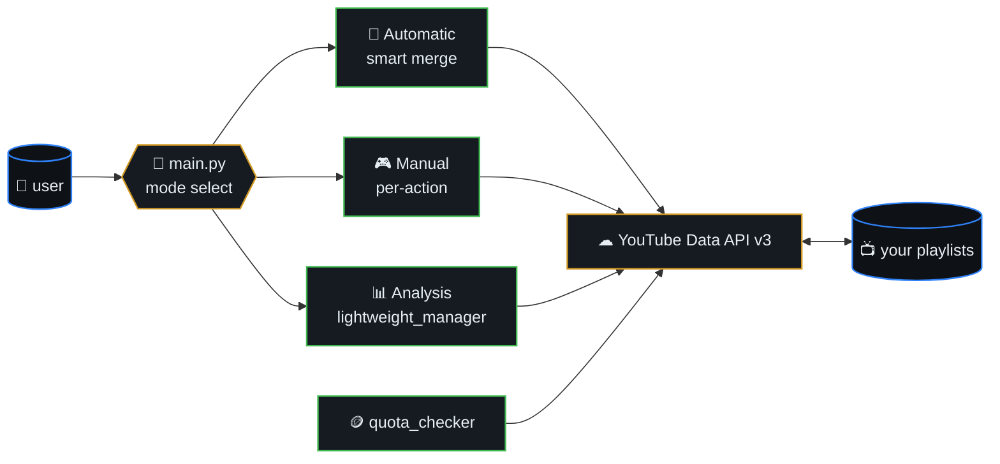
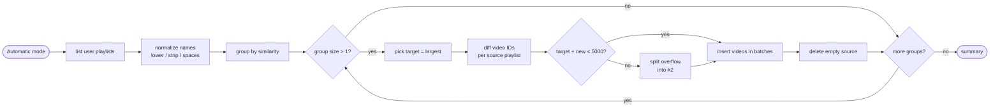
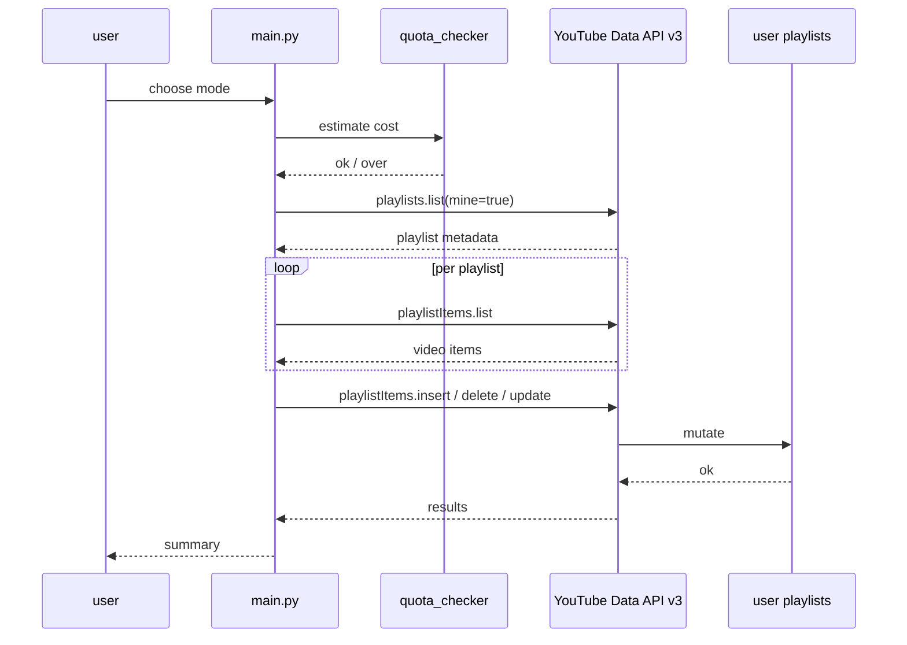
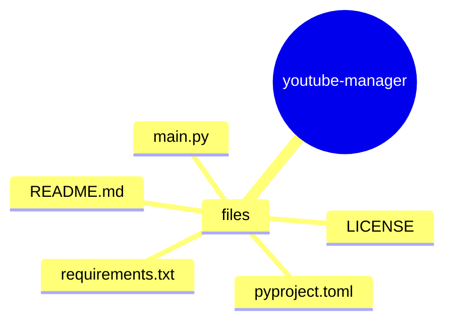
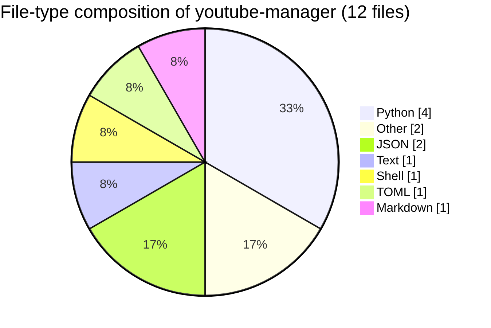

# 🎵 YouTube Playlist Manager

> A comprehensive Python tool for managing YouTube playlists with
> intelligent duplicate detection, automatic merging, and advanced
> playlist organization features.



## Table of contents

- [Features](#-features)
- [Auto-merge algorithm](#-auto-merge-algorithm)
- [API call sequence](#-api-call-sequence)
- [Quick Start](#-quick-start)
- [API Quota Usage](#-api-quota-usage)
- [Configuration](#-configuration)
- [Project Structure](#-project-structure)
- [Contributing](#-contributing)
- [License](#-license)
- [Important Notes](#-important-notes)
- [Troubleshooting](#-troubleshooting)
- [Future Features](#-future-features)
- [Support](#-support)
- [🗺️ Repository map](#️-repository-map)
- [📊 Code composition](#-code-composition)

## 🔁 Auto-merge algorithm



## 📡 API call sequence



## ✨ Features

### 🤖 Automatic Mode
- **Smart Duplicate Detection** - Finds playlists with similar names using intelligent normalization
- **Automatic Merging** - Combines duplicate playlists while preserving all videos
- **5000 Video Limit Handling** - Respects YouTube's playlist size limits
- **Bulk Operations** - Process multiple playlist groups at once

### 🎮 Manual Mode
- **Selective Merging** - Choose which playlists to merge and which to keep as target
- **Video Movement** - Move individual videos between playlists
- **Playlist Reordering** - Reorganize videos within playlists
- **Rename & Delete** - Full playlist management control
- **Real-time Analysis** - See duplicates and get recommendations

### 📊 Analysis Mode
- **Quota-Friendly** - Minimal API calls for when quota is limited
- **Statistics** - Shows total videos, large playlists, empty playlists
- **Duplicate Analysis** - Identifies potential merges without making changes
- **Space Optimization** - Calculates potential cleanup benefits

### 🛡️ Safety Features
- **Watch Later Protection** - Cannot be deleted or modified
- **Confirmation Prompts** - Prevents accidental deletions
- **Error Handling** - Graceful handling of API errors and rate limits
- **Quota Management** - Built-in quota monitoring and optimization

## 🚀 Quick Start

### Prerequisites
- Python 3.7+
- Google Cloud Project with YouTube Data API v3 enabled
- OAuth 2.0 credentials (credentials.json)

### Installation

1. **Clone the repository:**
   ```bash
   git clone https://github.com/yourusername/youtube-playlist-manager.git
   cd youtube-playlist-manager
   ```

2. **Create virtual environment:**
   ```bash
   python -m venv venv
   source venv/bin/activate  # On Windows: venv\Scripts\activate
   ```

3. **Install dependencies:**
   ```bash
   pip install -r requirements.txt
   ```

4. **Set up YouTube API credentials:**
   - Go to [Google Cloud Console](https://console.cloud.google.com/)
   - Create a new project or select existing one
   - Enable YouTube Data API v3
   - Create OAuth 2.0 credentials
   - Download credentials as `credentials.json`
   - Place in project root directory

### Usage

#### Main Application
```bash
python main.py
```

Choose from three modes:
- **🤖 Automatic Mode** - Smart merge all duplicates
- **🎮 Manual Mode** - Control each operation
- **📊 Analysis Only** - Just show what needs to be done

#### Lightweight Mode (Low Quota)
```bash
python lightweight_manager.py
```
Perfect for when you've hit API quota limits.

#### Quota Checker
```bash
python quota_checker.py
```
Check your current API quota status.

## 📋 API Quota Usage

YouTube Data API v3 has daily quotas (default: 10,000 units/day):

| Operation | Cost | Description |
|-----------|------|-------------|
| `playlists().list()` | 1 unit | Get playlist metadata |
| `playlistItems().list()` | 1 unit | Get videos in playlist |
| `playlistItems().insert()` | 50 units | Add video to playlist |
| `playlists().delete()` | 50 units | Delete playlist |
| `playlists().update()` | 50 units | Rename playlist |

**💡 Quota Tips:**
- Use Analysis mode first (minimal API calls)
- Batch operations when possible
- Wait for daily reset if quota exceeded
- Consider upgrading Google Cloud account for higher limits

## 🔧 Configuration

### Duplicate Detection Settings
The tool normalizes playlist names by:
- Converting to lowercase
- Removing common words: `playlist`, `videos`, `music`, `songs`, `collection`, `mix`, `favorites`, `liked`
- Removing punctuation and extra spaces
- Grouping similar names together

### Safety Settings
- **Watch Later** playlist is protected from all operations
- **5000 video limit** is enforced for all playlists
- **Confirmation prompts** for destructive operations
- **Rate limiting** to prevent API abuse

## 📁 Project Structure

```
youtube-playlist-manager/
├── main.py                 # Main application with all features
├── lightweight_manager.py  # Quota-friendly version
├── quota_checker.py        # API quota status checker
├── requirements.txt        # Python dependencies
├── README.md              # This file
├── .gitignore             # Git ignore rules
└── credentials.json       # YouTube API credentials (not in repo)
```

## 🤝 Contributing

1. Fork the repository
2. Create a feature branch (`git checkout -b feature/amazing-feature`)
3. Commit your changes (`git commit -m 'Add amazing feature'`)
4. Push to the branch (`git push origin feature/amazing-feature`)
5. Open a Pull Request

## 📝 License

This project is licensed under the MIT License - see the [LICENSE](LICENSE) file for details.

## ⚠️ Important Notes

- **Never commit your `credentials.json` file** - it contains sensitive API keys
- **Respect YouTube's Terms of Service** - don't abuse the API
- **Test with small playlists first** - to understand the tool's behavior
- **Backup important playlists** - before performing bulk operations

## 🆘 Troubleshooting

### Common Issues

**"Quota exceeded" error:**
- Wait until tomorrow (quotas reset daily)
- Use lightweight mode for minimal API usage
- Check Google Cloud Console for quota details

**Authentication errors:**
- Ensure `credentials.json` is in the project root
- Check that YouTube Data API v3 is enabled
- Verify OAuth 2.0 credentials are configured correctly

**Empty playlists after merge:**
- Check for private/unavailable videos
- Verify source playlists weren't deleted prematurely
- Review API error logs for specific issues

## 🎯 Future Features

- [ ] Playlist backup and restore
- [ ] Advanced filtering options
- [ ] Playlist analytics and insights
- [ ] Bulk video operations
- [ ] Playlist sharing utilities
- [ ] Integration with other music services

## 📧 Support

If you encounter issues or have questions:
1. Check the [Issues](https://github.com/yourusername/youtube-playlist-manager/issues) page
2. Create a new issue with detailed information
3. Include error messages and steps to reproduce


## 🗺️ Repository map

Top-level layout of `youtube-manager` rendered as a Mermaid mindmap (auto-generated from the on-disk tree).




## 📊 Code composition

File-type breakdown of source under this repo (skips `.git`, `node_modules`, build caches, lockfiles).


